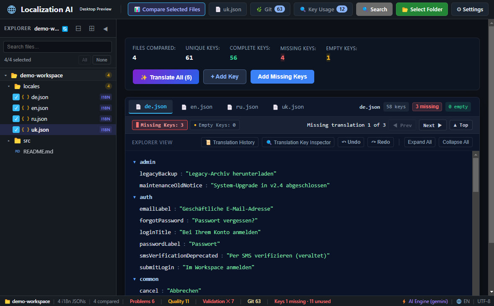
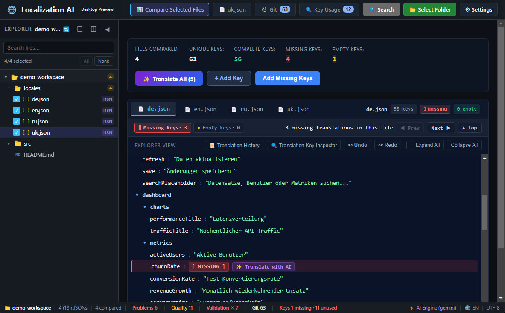
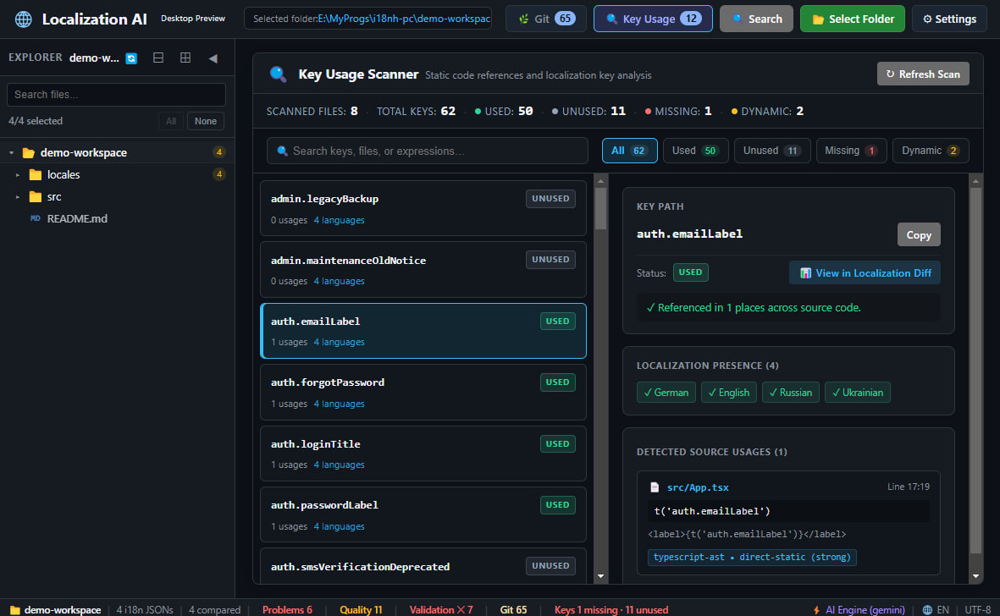
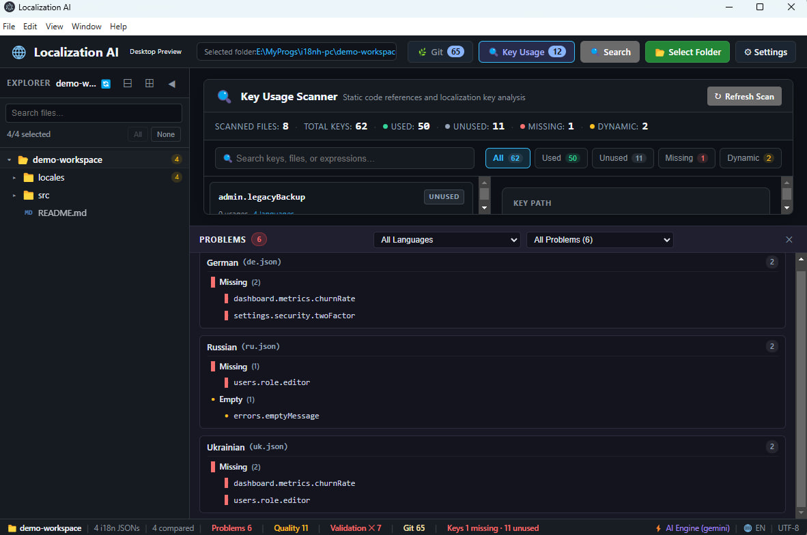
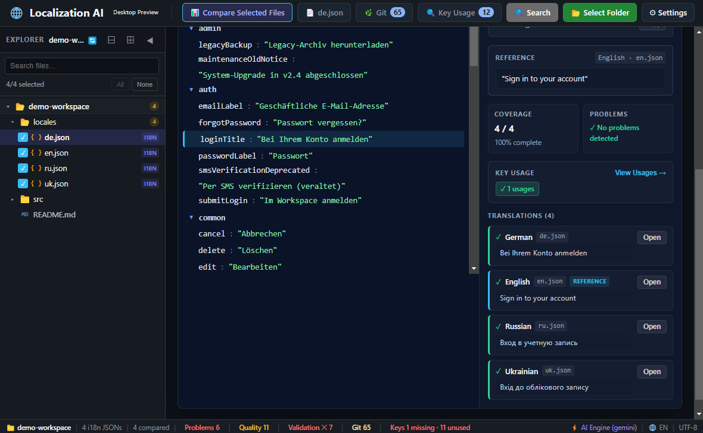

# Localization AI

Localization AI is a desktop developer tool for maintaining JSON localization dictionaries. It helps developers compare language files, find missing and extra keys, edit translations, validate localization consistency, and analyze whether localization keys are referenced by application source code.

Repository: [https://github.com/kimrenny/i18n-ai](https://github.com/kimrenny/i18n-ai)

---

## What Problem Does It Solve?

Software applications that support multiple languages store translations across multiple localization files:

```text
my-app/
├── src/
│   ├── App.tsx
│   └── components/
└── locales/
    ├── en.json
    ├── uk.json
    ├── de.json
    └── fr.json
```

As an application evolves:

* New translation keys added to one language file are often missing from others (`[ MISSING ]`).
* Translators or developers may leave empty strings (`""`) that go unnoticed (`[ EMPTY ]`).
* Deleted features leave behind dead keys in localization dictionaries.
* Interpolation placeholders like `{name}` or `{{count}}` can be corrupted, mistranslated, or omitted in target languages.
* A key path may be defined as a string in one file and as a nested object in another, causing runtime conflicts.

Localization AI compares your localization dictionaries in a unified matrix, highlights discrepancies, validates placeholder consistency, and statically scans your codebase to connect translation keys with source code references.

---

## Visual Overview

### 1. Localization Comparison
Compare multiple localization files side-by-side. The view displays a unified key hierarchy with real-time status indicators for every language.



### 2. Missing Translation Navigation
Step through missing and empty translations across files using previous/next controls, with automatic scrolling and cell highlighting.



### 3. Source-Code Key Usage Scanner
Analyze application source files to identify verified used keys, confirmed unused keys, and unresolvable dynamic expressions.



### 4. Localization Quality Checks
Detect placeholder mismatches, empty values, tag differences, and structural JSON conflicts before deployment.



### 5. Translation Key Inspector
Inspect all language variants, extracted parameter chips, quality warnings, and source code references for a selected key.



---

## How It Works

```text
Your Project
└── locales/
    ├── en.json
    ├── uk.json
    ├── de.json
    └── fr.json
        │
        ▼
Localization AI
        │
        ├── 1. Select Folder — Choose your project's localization directory
        ├── 2. Discover Files — Available JSON localization files are listed
        ├── 3. Select Files — Pick the files you want to inspect and compare
        ├── 4. Compare Keys — Compares key structures in a unified matrix
        ├── 5. Navigate Problems — Jump between missing, empty, or conflicting keys
        ├── 6. Edit & Validate — Edit text inline, add missing keys, and check quality
        └── 7. Save Changes — Writes updates directly back to your local JSON files
```

---

## Localization Files

Localization AI currently works with **JSON (`.json`) localization files**.

### Directory Structure

Place your translation files in a dedicated folder in your project:

```text
my-app/
├── src/
│   ├── App.tsx
│   └── components/
├── locales/
│   ├── en.json
│   ├── uk.json
│   ├── de.json
│   └── fr.json
└── package.json
```

In Localization AI, click **Select Folder** and choose the `locales/` directory.

### JSON Structure and Nested Keys

Both flat and nested JSON structures are supported. Nested structures are flattened into dot-notation paths:

```json
{
  "common": {
    "buttons": {
      "save": "Save",
      "cancel": "Cancel"
    },
    "messages": {
      "welcome": "Welcome, {name}!"
    }
  },
  "auth": {
    "login": {
      "title": "Sign in"
    }
  }
}
```

The application parses this into individual key paths:

* `common.buttons.save`
* `common.buttons.cancel`
* `common.messages.welcome`
* `auth.login.title`

The user interface displays these paths as a hierarchical tree. When saving, the application preserves the original nested JSON structure.

### Filenames and Language Recognition

* **Filenames as Identifiers**: Filenames like `en.json`, `uk.json`, `de.json`, or `fr.json` identify each language file.
* **Arbitrary Filenames**: Any valid `.json` file in the selected directory can be selected for comparison (excluding standard project configuration files like `package.json` or `tsconfig.json`). Files do not have to follow a strict naming convention to be compared.
* **Language Detection**: When filenames match standard language codes or aliases (e.g. `en.json`, `de.json`, `uk.json`, `ua.json`, `pt-BR.json`, `zh-CN.json`), the application maps them to readable language names for display and translation services.

### Base Language Behavior

* **Comparison does not require a base language**: The comparison matrix is computed from the union of all keys across all selected files. Any two or more JSON files can be compared directly without assuming one file is the universal master schema.
* **Reference selection**: For features that compare translations against a source string (such as placeholder consistency checks or automated translation), English (`en.json`) is used as the reference if present. If `en.json` is not selected, the file containing the most keys is used as the reference.

---

## Missing, Empty, and Extra Keys

When comparing localization files, keys are categorized into four states:

```text
en.json:
{
  "common": {
    "save": "Save",
    "cancel": "Cancel",
    "delete": "Delete"
  }
}

de.json:
{
  "common": {
    "save": "Speichern",
    "cancel": "Abbrechen"
  }
}
```

| Status | Meaning | Example |
| :--- | :--- | :--- |
| **Missing** | Key does not exist in this localization file. | `common.delete` is missing in `de.json` |
| **Empty** | Key exists in the file, but its value is an empty string `""`. | `"delete": ""` in `de.json` |
| **Extra** | Key exists in this file but not in the compared reference file. | `admin.legacy` present only in `de.json` |
| **Structural Conflict** | Incompatible JSON structures share the same key path. | `user.name` string vs `user.name.first` object |

### What to Do After Finding a Problem

* **Navigate**: Use the Next/Previous problem controls or `Alt+N` / `Alt+P` keyboard shortcuts to step between missing and empty keys.
* **Inspect**: Open the Translation Key Inspector to view the key across all languages, check extracted variables, and view code references.
* **Edit Inline**: Click any cell in the comparison view to update translation text directly.
* **Add Missing Keys**: Click **Add Missing Keys** to insert missing keys as empty strings. The application creates intermediate parent objects (e.g. `common -> buttons -> save`) while preserving existing keys and sibling values.
* **Rename Keys**: Use the Rename Key modal to update a key path across all localization files simultaneously.
* **Validate**: Run Quality checks or the Pre-flight Validator to verify placeholder and markup consistency.
* **Save**: Changes are saved directly to your local JSON files.

---

## Key Usage Scanner (Source Code Analysis)

The Key Usage Scanner searches your application source code for references to localization keys and compares those references with the keys defined in your JSON dictionaries.

### Key Classification Statuses

* **Used**: The key exists in localization files and has at least one confirmed static reference in scanned source code.
* **Confirmed Unused**: The key exists in localization files but has zero references in source files and does not match any dynamic expression pattern.
* **Missing in Dictionary**: The key is called in source code (e.g. `t('errors.notFound')`) but does not exist in any localization file.
* **Possible Dynamic Usage**: The key is not directly referenced, but matches the static prefix or suffix of an unresolvable dynamic expression in code.
* **Dynamic Expressions**: A source-code translation call whose key argument cannot be resolved to a single static string.

### Static Resolution vs. Runtime Keys

The scanner resolves common static key patterns:

```ts
// Direct static call -> 'common.save'
t('common.save');

// Constant propagation -> 'common.save'
const SAVE_KEY = 'common.save';
t(SAVE_KEY);

// Static concatenation -> 'dashboard.metrics.uptime'
const prefix = 'dashboard.metrics.';
t(prefix + 'uptime');

// Finite ternary union -> 'users.status.active', 'users.status.inactive'
t(isActive ? 'users.status.active' : 'users.status.inactive');
```

### Static Analysis Limitation

> **Static analysis can resolve what is statically knowable, but it cannot guarantee discovery of localization keys generated entirely at runtime.**

When key names depend on runtime data (such as API responses, database records, or user input), static analysis cannot determine the final key string:

```ts
// Runtime dynamic key:
const key = 'ADMIN.USER.' + section;
t(key);
```

If `section` is only known at runtime, the scanner cannot determine whether the application will request `ADMIN.USER.PROFILE`, `ADMIN.USER.SETTINGS`, or `ADMIN.USER.PERMISSIONS`.

In this scenario:
1. `ADMIN.USER.${section}` is reported under **Dynamic Expressions**.
2. Dictionary keys matching `ADMIN.USER.*` are categorized as **Possible Dynamic Usage** rather than marked as confirmed unused.

### Supported Technologies & Detectors

Source scanning is performed via static pattern detectors:

| Technology | Supported File Extensions | Patterns Detected |
| :--- | :--- | :--- |
| **TypeScript / JavaScript** | `.ts`, `.tsx`, `.js`, `.jsx`, `.mjs`, `.cjs` | `t('key')`, `i18n.t('key')`, `translate('key')`, `formatMessage({ id: 'key' })` |
| **React** | `.tsx`, `.jsx` | `useTranslation()`, `<Trans i18nKey="key" />`, `t('key')` |
| **Angular HTML** | `.html` | `{{ 'key' \| translate }}`, `[translate]="'key'"`, `translate="key"` |
| **Vue SFC** | `.vue` | `$t('key')`, `v-t="'key'"`, `<i18n-t keypath="key">`, script translations |
| **Svelte SFC** | `.svelte` | `$t('key')`, `t('key')`, `$_('key')` |
| **.NET / C# / Razor** | `.cs`, `.razor` | `_localizer["key"]`, `IStringLocalizer["key"]`, `@Localizer["key"]` |

---

## Other Features

### Editing and Inspection
* **Inline Editing**: Edit translation values directly in the comparison matrix.
* **Add Translation Key**: Add a new key path across selected or all localization files with validation preventing empty segments or leading/trailing dots.
* **Rename Key**: Rename key paths across all localization files while preserving existing translated values.
* **Translation Key Inspector**: Panel showing language variants, parameter chips (`{name}`, `{{count}}`), quality issues, and source code references.
* **Translation History**: Action log of recent edits, additions, and deletions with undo and revert capabilities.

### Quality and Validation
* **Placeholder Validation**: Checks for missing, extra, or modified parameters (`{name}`, `{{count}}`, `%s`, `:param`).
* **HTML/XML Tag Validation**: Detects missing, extra, or corrupted markup (`<b>`, `</b>`, `<a href="...">`).
* **Empty Value Detection**: Flags keys present in JSON with empty string values.
* **Whitespace Validation**: Identifies leading or trailing spaces not present in reference strings.
* **Structural Conflict Detection**: Identifies keys used as both direct string values and parent object sections.
* **Pre-flight Validator**: Summary panel aggregating blocking errors and non-blocking warnings before release or commit.

### Git Version Control Integration
* **Working Changes**: View modified, added, deleted, and untracked localization files.
* **Visual Diff**: Side-by-side diff view of uncommitted changes.
* **Selective Commit**: Stage and commit specific localization files with pre-flight validation checks.
* **Branch Management**: Switch branches or create new branches with uncommitted change conflict safeguards.
* **Remote Sync**: Fetch, Pull, and Push with upstream branch configuration and merge conflict detection.

### Assisted Translation (Optional)
* **AI Providers**: OpenAI, Google Gemini, Anthropic Claude, Mistral AI, xAI Grok, DeepSeek, and local Ollama.
* **Free Providers**: LibreTranslate (local Docker or public URL) and MyMemory.
* **Batch Optimization**: Batches untranslated keys into chunked requests with automatic rate-limit retry handling.
* **Placeholder Safety**: Validates translations before acceptance; responses that alter variables or tags are rejected.
* **Review Modal**: Review and edit proposed translations before applying changes to disk.

---

## Technical Architecture

```text
React UI
  │
  ▼ Electron IPC
  ├── Workspace & File operations
  ├── Localization parsing & comparison
  ├── Key Usage Scanner & Detectors
  ├── Git service
  └── Translation services
```

* **Frontend**: React, TypeScript, and CSS.
* **Desktop Runtime**: Electron main process with IPC communication.
* **Core Services**: TypeScript modules for parsing, comparison, AST detection, and validation.

---

## Getting Started

### Prerequisites

* [Node.js](https://nodejs.org/) (version 18.0 or higher)
* [npm](https://www.npmjs.com/) (version 9.0 or higher)
* [Git](https://git-scm.com/) installed and available in system PATH (for Git features)

### Installation & Run

```bash
# 1. Clone the repository
git clone https://github.com/kimrenny/i18n-ai.git
cd i18n-ai

# 2. Install dependencies
npm install

# 3. Start development server and launch Electron
npm run dev
```

### Basic Usage

1. Click **Select Folder** and choose the folder containing your JSON translation files (e.g. `my-app/locales/`).
2. Select the JSON files you want to compare from the discovered list.
3. Click **Compare Selected Files**.

---

## Development & Testing

### Available Scripts

| Command | Purpose |
| :--- | :--- |
| `npm run dev` | Starts Vite dev server and launches Electron app with hot reload. |
| `npm run build` | Compiles TypeScript and builds production bundles for frontend and Electron main process. |
| `npm run typecheck` | Runs TypeScript type checking without emitting files (`tsc --noEmit`). |
| `npm run lint` | Runs ESLint across all source files. |
| `npm test -- --run` | Runs the Vitest test suite once across all test files. |

---

## Known Limitations

1. **Static Analysis of Runtime Keys**: As described in the Key Usage Scanner section, dynamically constructed keys whose names are determined at runtime cannot be resolved by static analysis.
2. **JSON Format Scope**: The application currently works with JSON (`.json`) localization dictionaries. Other formats (such as `.yaml`, `.properties`, `.po`, or `.xliff`) are not currently supported.
3. **Large Repository Git Scanning**: In repositories with tens of thousands of uncommitted non-localization files, full Git status refreshes may experience brief processing delays.

---

## Contributing

1. Fork the repository: [https://github.com/kimrenny/i18n-ai](https://github.com/kimrenny/i18n-ai)
2. Create a feature branch (`git checkout -b feature/my-feature`).
3. Ensure all tests and checks pass (`npm test -- --run`, `npm run typecheck`, `npm run lint`).
4. Submit a Pull Request.

---

## License

This project is licensed under a permissive custom license that permits commercial and non-commercial use, modification, and redistribution, provided that the original author copyright and attribution notice are retained. See the [LICENSE](LICENSE) file for the full text.
